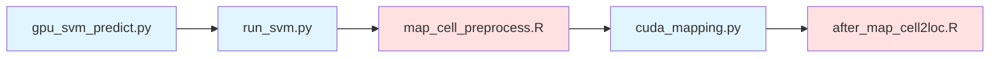

# Alternative pipeline for `SuoLab-GZLab/CMAP`. 

> [!WARNING]
> Although this pipeline has been reproduced as closely as possible, further validation and feedback through wet lab experiments are required.

This pipeline needs GPU for accleration. 

This repository addresses two issues with the CMAP package:

1. For spatial transcriptomics datasets with more than 10k spots or cross-mapping of single-cell data with over 10k cells, the current implementation is very slow.

The CMAP tutorial even emphasizes that randomforest or XGBoost can be used as substitutes for SVM. Therefore, in this implementation, the `cuml`-based SVM may suffer from reduced accuracy, but for large datasets, it is perhaps one of the viable option we can afford. In mapping part, we also use GPU to make calculation affordable. 

CMAP is primarily compatible with non-10x Visium HD datasets. Therefore, we rebinned the Visium HD data at approximately three times the minimum spatial point distance (integrating roughly 9 minimum 8-micron units) to adapt it for algorithms designed for non-HD datasets.
  
2. Most users either do not have suitable local machines, or, when memory-intensive devices and GPU devices are separate, may prefer a split, step-by-step execution mode.

