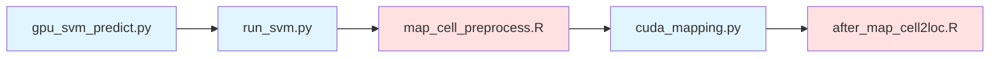

# Potential acceleration of `SuoLab-GZLab/CMAP`. 

This repository addresses two issues with the CMAP package:

1. For spatial transcriptomics datasets with more than 10k spots or cross-mapping of single-cell data with over 10k cells, the current implementation is very slow.
  
2. Most users either do not have suitable local machines, or, when memory-intensive devices and GPU devices are separate, may prefer a split, step-by-step execution mode.

